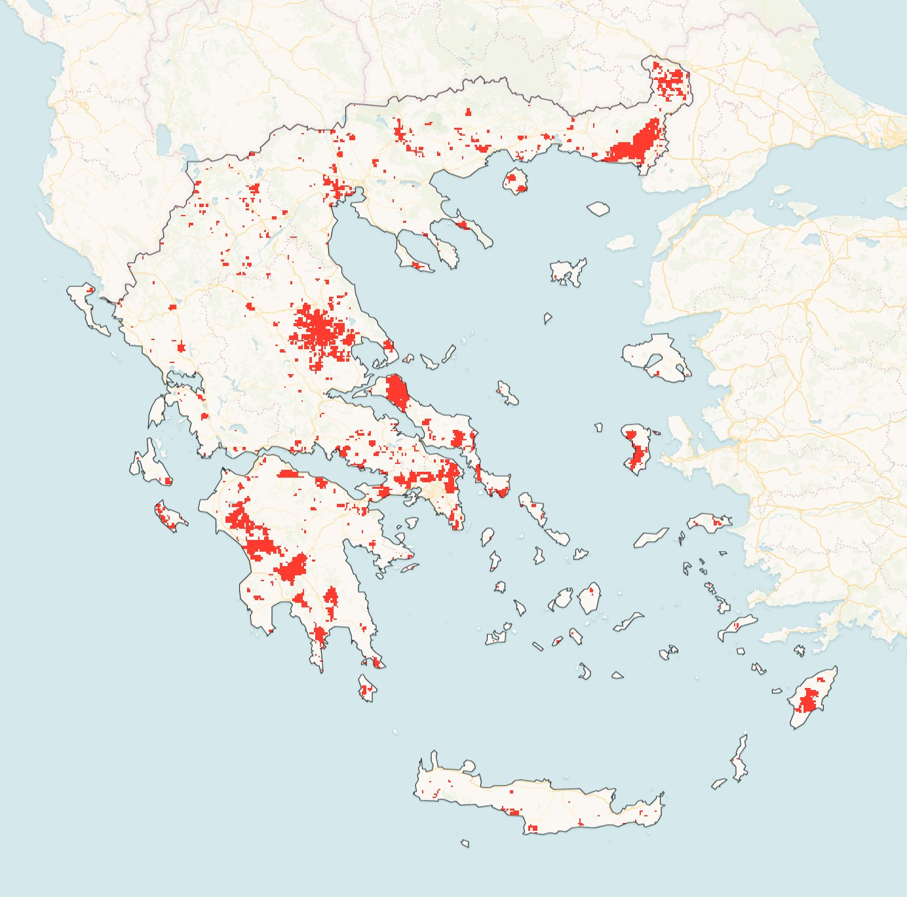

# Greece Wildfire Analysis (2000–2025)

**[Live map](https://gp-80.github.io/greece-wildfire-analysis/greece_burned_2000_2025.html)** — opens directly in the browser, no login required.



Annual burned area mapping across Greece using MODIS satellite data processed via Google Earth Engine, rendered as a self-contained interactive Folium map.

---

## Overview

Uses the MODIS MCD64A1 v6.1 burned area product to extract and visualise yearly fire footprints across Greece from 2000 to 2025. Each year is a toggleable layer on a Carto Voyager basemap. A live counter in the bottom-right corner updates the total burned area as layers are toggled on and off.

All 26 annual layers are embedded as base64-encoded PNGs directly in the HTML — the file opens with no server, no login, and no GEE access.

---

## Key statistics (MODIS MCD64A1, 500 m, 2000–2025)

| Period | Burned area |
|--------|------------|
| Total 2000–2025 | **16,274 km²** |
| Worst year | **2007 — 3,123 km²** (Peloponnese) |
| 2nd worst | **2023 — 1,710 km²** |
| 3rd worst | **2021 — 1,292 km²** (Evia) |
| 4th worst | **2008 — 1,118 km²** |
| Year 2000 | ~5 km² (MODIS had no full-year coverage) |

2023 exceeded the 2021 Evia fires and is the second-worst year in the record.

---

## Resolution and accuracy

Burned area statistics are computed at **native MODIS 500 m resolution** using pixel-area-weighted reduction in GEE. The map tiles are rendered at **2,000 m** (4× downsampling) to keep the HTML file portable and self-contained.

A pixel-area comparison across all 26 years shows the two resolutions agree to within **0.9%** of total burned area (16,135 km² at 2,000 m vs 16,274 km² at 500 m). The coarser resolution introduces no meaningful error in area estimates — only reduced visual density at close zoom levels.

The thumbnails are rendered in **EPSG:3857** (Web Mercator) to match Leaflet's internal projection, ensuring burned-area patches align correctly with the basemap and geographic features.

---

## Usage

### View the map (no setup required)

Open the **[live map](https://gp-80.github.io/greece-wildfire-analysis/greece_burned_2000_2025.html)** in any browser, or clone the repo and open `greece_burned_2000_2025.html` locally.

### Rebuild HTML from existing data (no GEE required)

The `data/` folder is committed — no GEE account needed to regenerate the map.

```
pip install -r requirements.txt
python greece_wildfire_analysis.py
```

### Reproduce from scratch (GEE account required)

1. Register a project at https://code.earthengine.google.com (free)
2. Install dependencies:
   ```
   pip install -r requirements.txt
   ```
3. Run:
   ```
   python greece_wildfire_analysis.py --regenerate --project YOUR_PROJECT_ID
   ```
   On first run a browser window opens for Google OAuth. Credentials are saved to `~/.config/earthengine/credentials` and reused on subsequent runs.

---

## GEE preview

`gee_preview.js` can be pasted into the [GEE Code Editor](https://code.earthengine.google.com) to visualise the same dataset at native 500 m resolution for direct comparison. Layers are off by default — enable individual years in the Layers panel.

`compare_areas.py` runs a side-by-side comparison of burned area at 500 m vs 2,000 m vs PNG pixel counts:

```
python compare_areas.py --project YOUR_PROJECT_ID
```

---

## Stack

- Python, Google Earth Engine (`earthengine-api`), Folium, Pillow, NumPy
- Data: MODIS MCD64A1 v6.1 — NASA / UMD
